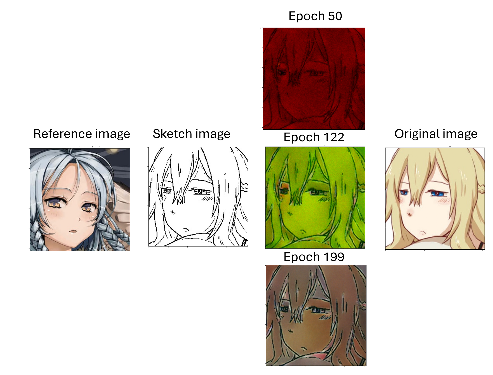

# Sketch Colorization Using Diffusion Models & Photo-Sketch Correspondence

[](https://github.com/AxelDlv00/DiffusionSketchColorization) [](https://huggingface.co/datasets/ComputerVisionAnimeProject/AnimeFaceColorization/blob/main/README.md) [](https://huggingface.co/ComputerVisionAnimeProject/AniDiffusionModel)

## Overview
This project explores **anime sketch colorization** using state-of-the-art **diffusion models** and **photo-sketch correspondence techniques**. Inspired by recent advancements in **AnimeDiffusion**, **MangaNinja**, and **photo-sketch correspondence models**, our method is a lighter model.

[](LICENSE)  
**Authors:** Axel Delaval, Adama Koïa  

---

## Project Structure

```bash
.
├── LICENSE                     # Apache 2.0 License
├── sketch_colorization.pdf     # Report
├── README.md                   # This file
├── requirements.txt            # Python dependencies
├── distributed.py              # Distributed training setup
├── trainer.py                  # Main training loop
├── assets                      # For the readme
├── models/                     # Core model architecture
│   ├── attention.py
│   ├── denoising_unet.py
│   ├── psc_diffusion.py
│   ├── reference_unet.py
│   ├── residual_block.py
│   └── components/
├── psc_project/                # (External) PSC model and utils
│   ├── models/
│   └── utils/
├── utils/                      # General utilities
│   ├── data/, image/, logger/, path/, pythonic/, visualization/
```

---

## Architecture

- `Reference U-Net`: Extracts semantic & color features from reference
- `Denoising U-Net`: Diffusion backbone to reconstruct clean outputs
- `PSC Model`: Warps reference features using deformation flow
- `Cross-Attention`: Fuses semantic guidance into the generation path

Details in our [paper (PDF)](sketch_colorization.pdf)

---

## Installation

```bash
git clone https://github.com/AxelDlv00/DiffusionSketchColorization.git
cd DiffusionSketchColorization
pip install -r requirements.txt
```

---

## Visual Results

 

---

## Citation

```bibtex
@misc{delaval2025diffusion,
  author = {Axel Delaval and Adama Koïa},
  title = {Sketch Colorization Using Diffusion Models and Photo-Sketch Correspondence},
  year = {2025},
  institution = {École Polytechnique — Telecom-Paris},
  howpublished = {\url{https://github.com/AxelDlv00/DiffusionSketchColorization}}
}
```

---

## License

Licensed under the [Apache License 2.0](LICENSE).

---

## Acknowledgements

- [AnimeDiffusion](https://arxiv.org/abs/2303.11137)
- [MangaNinja](https://arxiv.org/abs/2501.08332)
- [LoFTR, SuperGlue, DinoV2](https://paperswithcode.com)
- Danbooru & HuggingFace for datasets


## Citing
If you use this model, please cite:
```
@misc{delavalkoita2025sketchcolorization,
  author       = {Axel Delaval and Adama Koïta},
  title        = {Sketch Colorization Using Diffusion Models and Photo-Sketch Correspondence},
  year         = {2025},
  url          = {https://github.com/AxelDlv00/DiffusionSketchColorization},
  note         = {Project exploring anime sketch colorization using diffusion models and deep learning.}
}
```

---

_This project was developed as part of our coursework at École Polytechnique and Télécom Paris._

